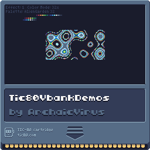

# Tic80DemoCarousel
For displaying various pixel drawing effects, using up to 31 colors on the Tic80 platform.

## Controls

| Key                  | Action                                           |
|----------------------|--------------------------------------------------|
| Left / Right Arrows  | Switch between effects.                          |
| Up / Down Arrows     | Swap the current palette.                        |
| Numpad Minus (-)     | Reset the palette to its original state.         |
| Numpad Plus (+)      | Sort the palette by hue.                         |
| Numpad Enter         | Sort the palette by brightness.                  |
| Numpad 1             | Toggle color mode between 16x and 32x.           |
| Numpad 4 & 6         | Cycle through background colors.                 |
| Numpad 0             | Disable the user interface (UI).                 |

### Color Modes

- **16x Color Mode**: Uses a 16-color palette, and generates a new, 2nd darker palette from these colors, resulting in a total use of 31 colors.
- **32x Color Mode**: Uses a native 32-color palette, - index 1 for vbank transparency

- 

